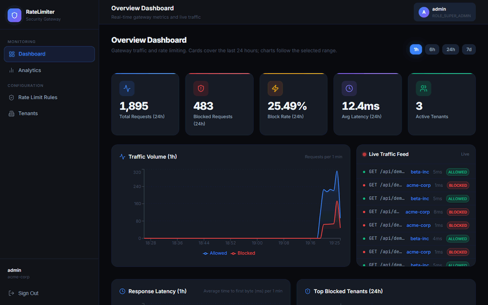
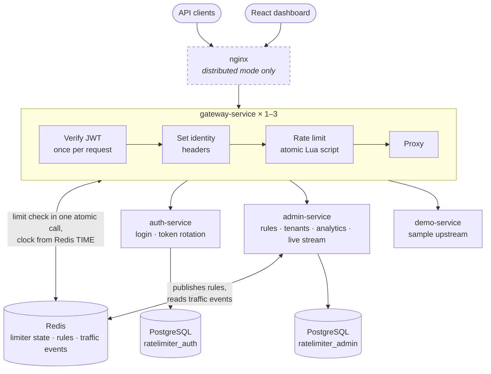
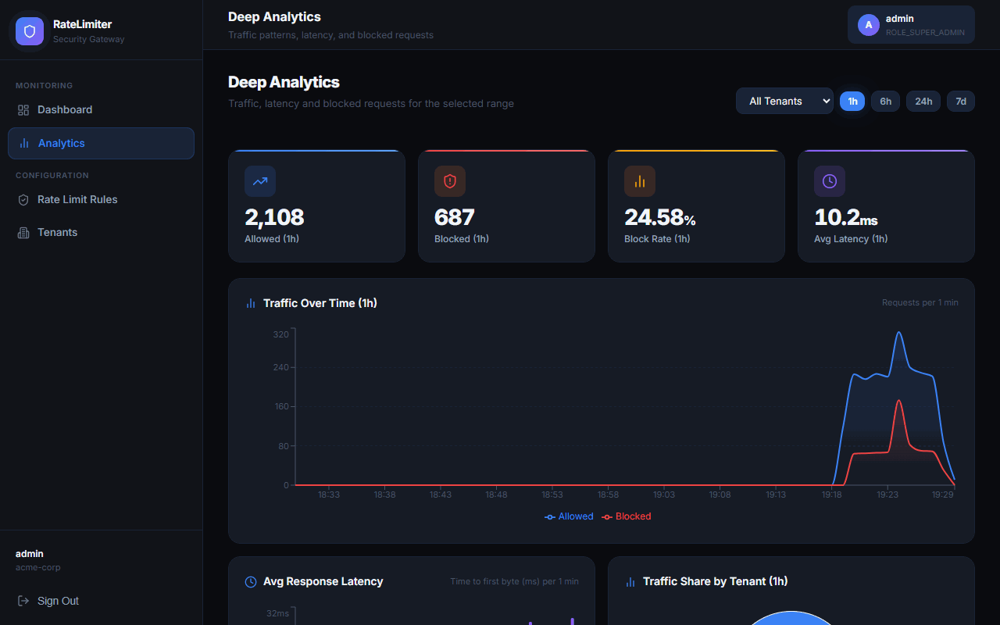

# API Rate Limiter & Security Gateway

[](https://github.com/nikhilpoojary05/api-rate-limiter/actions/workflows/ci.yml)

A multi-tenant API gateway built on Spring Cloud Gateway. It authenticates every request
with a JWT, enforces per-tenant rate limits with **sliding-window and token-bucket
algorithms implemented as atomic Redis Lua scripts**, and gives each tenant's
administrators a tenant-scoped admin API and a React dashboard with live traffic.



*Live dashboard while john.doe (100 requests/min) exceeds his limit and jane.smith stays
under hers: blocked requests in red, every figure read from the gateway's real traffic.*

**Measured, not claimed** — details in [`loadtest/RESULTS.md`](loadtest/RESULTS.md):

| | Result |
|---|---|
| **Exact under concurrency** | 15,000 requests from 50 users at concurrency 200: every user admitted exactly their limit, both algorithms. **0 of 50 off by even one.** |
| **Exact across instances** | The same test through nginx in front of **three gateway replicas** sharing one Redis: **0 of 50 off.** |
| **Throughput** | **~4,700 req/s** through the full gateway path, p50 3.4 ms at concurrency 16, on one laptop (i5-13420H) that also runs the load generator, upstream and Redis. |
| **Profiled and tuned** | Java Flight Recorder showed each JWT verified six times per request; verifying once cut its CPU share from 23% to 10% and raised throughput 8% in a controlled A/B test. |
| **Tested** | **80 tests**, including concurrency tests broken on purpose to confirm they fail. |

---

## Architecture



| Module | Port | Role |
|---|---|---|
| `gateway-service` | 8080 | The only published service. Verifies JWTs, sets identity headers, rate-limits, proxies. |
| `auth-service` | 8081 | Login, registration, refresh-token rotation. |
| `admin-service` | 8082 | Rate-limit rules, tenants, traffic analytics, live SSE stream. |
| `demo-service` | 8083 | Sample upstream; endpoints exist only under the `demo` profile. |
| `common` | — | Shared JWT handling and DTOs. |
| `dashboard` | 3000 | React + Vite admin UI; talks only to the gateway. |

Each service also has an actuator on a separate management port (9080–9083) that is never
published outside the Docker network.

---

## How rate limiting works

For each request the gateway:

1. **Verifies the JWT once** (signature and expiry) and reads the tenant, user and tier.
2. **Sets identity headers** — `X-Tenant-Id`, `X-User-Id`, `X-User-Roles` — from the token,
   discarding any the client sent. Downstream services trust these, so only the gateway may
   set them.
3. **Looks up the rule** for `tenant:tier`. The admin service publishes rules from
   PostgreSQL to Redis on startup and on every change, and restores them within a minute
   if Redis loses them; the gateway reloads them every 30 s.
4. **Runs the limiter as a single Lua script**, so check-and-increment is atomic: concurrent
   requests cannot all see "under the limit" and all get in. The script takes the time
   from Redis (`TIME`), not from the gateway, so several gateway instances on different
   servers agree on the window even when their clocks drift.
5. Returns `429 Too Many Requests` with `Retry-After`, or proxies the request.

**Sliding window** — a sorted set per `tenant:user`, scored by timestamp. Each entry's member
is `timestamp-uuid`; with a timestamp alone, two requests in the same millisecond would
collide and one would go uncounted.

**Token bucket** — a hash of tokens and last-refill time. Rules are stored as
*requests per window*; the gateway converts that to a per-second refill rate, and sizes the
key's TTL to a full refill so an idle bucket cannot reset to full early.

**Failure modes are deliberate:**

| Situation | Behaviour |
|---|---|
| No rule for the tenant/tier | A default limit (60/min), not unlimited access |
| Redis unreachable | Fail closed — deny (`ratelimit.fail-open=true` to invert) |
| Unauthenticated `/api/auth/**` | Limited per source IP (20/min), so login can't be brute-forced |

---

## Security model

- **Tokens.** HMAC-signed JWTs; the algorithm follows key length (HS512 for a 64-byte key).
  Services refuse to start without `JWT_SECRET`, with one under 32 bytes, or with either
  placeholder key that once shipped in this repo.
- **Network.** Only the gateway is published. Backend services sit on the internal network;
  Postgres, Redis and the monitoring stack bind to `127.0.0.1`. Redis requires a password.
- **Tenant isolation.** `ROLE_ADMIN` is pinned to its own tenant on every admin endpoint,
  including id-addressed ones, where the check runs after loading the entity.
  `ROLE_SUPER_ADMIN` is required for cross-tenant reads, creating tenants and republishing
  rules. The live traffic stream only delivers the subscriber's own tenant's events.
- **Refresh tokens.** Sent as an `HttpOnly; SameSite=Strict` cookie, never in a URL, and
  rotated on every use. Replaying a spent token revokes every outstanding token for that user.
- **Registration** requires the tenant's registration code, so nobody can join a tenant —
  and inherit its rate-limit tier — uninvited.
- **Login** is limited per IP at the gateway and per account in the auth service
  (5 failures → 15-minute cooling-off), and gives the same answer for an unknown user, a
  wrong password and a disabled account.
- **Responses** carry `nosniff`, `X-Frame-Options: DENY`, `Referrer-Policy: no-referrer`
  and a restrictive CSP. HSTS and the cookie's `Secure` flag are switched on with TLS.
- Containers run as a non-root user with CPU and memory limits.

---

## Running it

### 1. Configure

```bash
cp .env.example .env
```

Fill in `.env`. Generate the JWT secret rather than inventing one:

```bash
openssl rand -base64 48
```

### 2a. Docker Compose

```bash
mvn clean package -DskipTests
docker compose up --build
```

Postgres creates both application databases on first start
([`docker/postgres-init`](docker/postgres-init)). If you change that script, recreate the
volume with `docker compose down -v`.

This starts all nine containers: the four services, PostgreSQL, Redis, Prometheus, Grafana
and Zipkin. The gateway is published on port 8080; Postgres, Redis and the monitoring tools
are published on loopback only.

If a local Postgres, Redis or another program already holds one of those ports, set
`GATEWAY_PORT`, `POSTGRES_HOST_PORT` or `REDIS_HOST_PORT` in `.env`. The containers keep
using the standard ports among themselves.

To run **three gateway instances behind nginx**, all sharing one Redis, add the
distributed file. The gateway is still reached on the same port, now through nginx:

```bash
docker compose -f docker-compose.yml -f docker-compose.distributed.yml up -d --build
```

### 2b. Local, on Windows (how this was developed)

Needs Java 21+, Maven 3.9+, PostgreSQL and Redis running locally.

```bash
mvn clean package -DskipTests
```

```powershell
.\start-all.ps1
```

The script reads `.env`, creates `ratelimiter_auth` and `ratelimiter_admin` if missing, and
starts the four services. Re-running it restarts them. It only ever stops its own services:
if something else holds one of its ports, it names the process and exits rather than
killing it.

- The gateway uses port 8080 unless `GATEWAY_PORT` is set in `.env`. Oracle Database's
  listener, among others, often holds 8080.
- It runs from wherever the repo is checked out, but assumes PostgreSQL 18 is in its default
  install path; edit that path near the top of the script if not.
- If your local Redis has a password, add `SPRING_DATA_REDIS_PASSWORD` to `.env`.

### 3. Dashboard

```bash
cd dashboard
npm install
npm run dev
```

Opens on http://localhost:3000 and proxies `/api` to the gateway on 8080. If the gateway is
on another port, start it with `GATEWAY_URL=http://localhost:<port> npm run dev`.



Every figure comes from the admin API: summary cards, traffic over time for 1 h to 7 d,
traffic share per tenant and the latest events. A tenant administrator sees only their
own tenant.

---

## Try it

Seeded accounts — **demo data only**:

| Username | Password | Tenant | Roles |
|---|---|---|---|
| `admin` | `Admin@123!` | acme-corp | `ROLE_ADMIN`, `ROLE_SUPER_ADMIN` |
| `john.doe` | `Test@123!` | acme-corp | `ROLE_USER` |
| `jane.smith` | `Test@123!` | beta-inc | `ROLE_USER` |

Seeded rules: acme-corp 100/min (sliding window), beta-inc 1,000/min (sliding window),
free-user-co 10/min with a burst of 20 (token bucket).

```bash
# Log in. The refresh token arrives as an HttpOnly cookie.
curl -c cookies.txt -X POST http://localhost:8080/api/auth/login \
  -H "Content-Type: application/json" \
  -d '{"username":"john.doe","password":"Test@123!"}'

TOKEN=...   # data.accessToken from the response

# Call the upstream through the gateway.
curl http://localhost:8080/api/demo/ping -H "Authorization: Bearer $TOKEN"

# acme-corp allows 100 per minute, and the call above counted as one:
# expect 99 × 200, then 429s.
for i in $(seq 1 105); do
  curl -s -o /dev/null -w "%{http_code}\n" http://localhost:8080/api/demo/ping \
    -H "Authorization: Bearer $TOKEN"
done | sort | uniq -c

# Get a new access token. The refresh token rotates; the old one is now dead.
curl -b cookies.txt -c cookies.txt -X POST http://localhost:8080/api/auth/refresh
```

To register, supply the tenant's UUID and registration code — for the demo, acme-corp is
`11111111-1111-1111-1111-111111111111` with code `acme-join-4f7c21`, beta-inc is
`22222222-2222-2222-2222-222222222222` with `beta-join-9b3e08`, and free-user-co is closed.
Passwords must be at least 12 characters.

---

## Configuration

Set in `.env` (see [`.env.example`](.env.example)):

| Variable | Purpose |
|---|---|
| `JWT_SECRET` | Token signing key. Required; ≥ 32 bytes. |
| `POSTGRES_USER`, `POSTGRES_PASSWORD` | Database credentials. |
| `REDIS_PASSWORD` | Required by the Compose Redis. |
| `CORS_ALLOWED_ORIGINS` | Browser origins allowed to call the API. |
| `AUTH_COOKIE_SECURE`, `SECURITY_HSTS_ENABLED` | Turn both on once TLS terminates in front of the gateway. |
| `GF_SECURITY_ADMIN_USER`, `GF_SECURITY_ADMIN_PASSWORD` | Grafana login. |

Gateway properties:

| Property | Default | |
|---|---|---|
| `ratelimit.default.request-limit` / `window-ms` | 60 / 60000 | Applied when no rule matches |
| `ratelimit.public.request-limit` / `window-ms` | 20 / 60000 | Per-IP limit on `/api/auth/**` |
| `ratelimit.fail-open` | `false` | Allow requests when Redis is down |

---

## Tests

```bash
mvn test
```

[CI](.github/workflows/ci.yml) runs them on every push, then starts the stack with three
gateways behind nginx and runs an [end-to-end smoke test](.github/scripts/smoke-test.sh)
(authentication, the exact limit, tenant isolation, refresh-token rotation) and the load
test's accuracy scenarios, which fail the build if any user is admitted the wrong amount.

80 tests across `common`, `gateway-service` and `admin-service`:

- **Limiters against a real Redis** — exact limits, window sliding, refill at the configured
  rate, capacity caps, and 300 concurrent requests in a single frozen millisecond admitting
  exactly the limit. Time is driven by an injectable clock, so nothing sleeps.
- **Several instances** — gateways whose clocks disagree over-admit when each passes its
  own time; on Redis's clock, three instances admit exactly the limit between them.
- **Failure handling** — both limiters deny when Redis is unreachable.
- **Identity** — forged and expired tokens rejected, client-supplied identity headers
  discarded, one JWT parse per request.
- **Authorization matrix** — the real admin security chain with signed tokens: cross-tenant
  access refused on every path, super-admin allowed, the live stream closed to non-admins.
- **Admin data** — traffic time series bucketed with empty periods filled, unknown ranges
  rejected; new tenants get a server-generated API key and duplicate IDs are refused.

Every security and concurrency guard was checked by breaking it on purpose and confirming a
test fails. That caught a concurrency test that could never have failed, and a missing test
for the stream's role gate — both fixed.

The Redis tests use Testcontainers when Docker is available, and otherwise a Redis on
`localhost:6379`, where they touch only keys under a random prefix and delete them
afterwards. With no Redis reachable they are skipped rather than failed.

A CVE scan is available but not part of the normal build — it needs a free
[NVD API key](https://nvd.nist.gov/developers/request-an-api-key):

```bash
mvn -Psecurity-scan verify -Dnvd.api.key=...
```

---

## Load testing

[`loadtest/LoadTest.java`](loadtest/LoadTest.java) is a dependency-free load generator:

```bash
JWT_SECRET=... java loadtest/LoadTest.java
```

It signs its own tokens, adds temporary rules for synthetic tenants, and on exit restores the
original rules and deletes everything it created. Method, full results and caveats:
[`loadtest/RESULTS.md`](loadtest/RESULTS.md).

---

## Known gaps

Stated plainly, so nobody finds them the hard way:

- **Grafana dashboard shows no data.** It queries custom metrics
  (`gateway_requests_total` and friends) that nothing emits yet. Prometheus does collect the
  standard Spring and JVM metrics — from the gateway and admin service only; auth and demo
  lack the registry.
- **Distributed tracing is not wired up.** Only the gateway has tracing dependencies, and
  Compose's `ZIPKIN_URL` is not mapped to the property Spring reads, so spans never reach Zipkin.
- **auth-service has no automated tests.** Its refresh-token rotation is transactional, and
  a test worth having needs a real Postgres.
- **Registration reveals** whether a username or email is already taken. Closing that needs
  an email-confirmation flow, which this has no mail transport for; `emailVerified` is
  recorded but not enforced.
- **Per-IP limiting trusts the socket address.** Behind a load balancer every request
  appears to come from the balancer until trusted forwarded headers are configured.
- **The live stream takes its token in the query string**, because the browser's
  `EventSource` cannot send headers. It is accepted on that one path only, but it does
  reach access logs.
- **Logging defaults to `DEBUG`** for `com.ratelimiter`, which writes roughly a line per
  request per filter. Run production at `INFO`.
